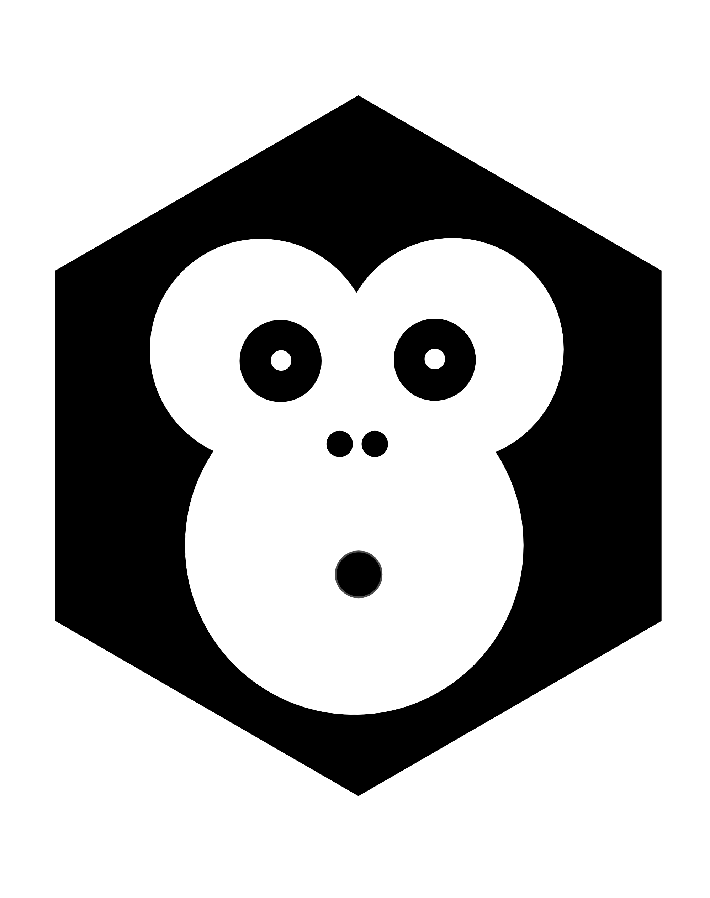

<!-- Adapted from othneildrew's git See: https://github.com/https://github.com/othneildrew/Best-README-Template ->

 
<!-- PROJECT SHIELDS -->
<!--
*** I'm using markdown "reference style" links for readability.
*** Reference links are enclosed in brackets [ ] instead of parentheses ( ).
*** See the bottom of this document for the declaration of the reference variables
*** for contributors-url, forks-url, etc. This is an optional, concise syntax you may use.
*** https://www.markdownguide.org/basic-syntax/#reference-style-links
-->
[![Contributors][contributors-shield]][contributors-url]
[![Forks][forks-shield]][forks-url]
[![Stargazers][stars-shield]][stars-url]
[![Issues][issues-shield]][issues-url]
[![Agape Blog][blog-shield]][blog-url]
[![Agape Course][course-shield]][course-url]
[![License][license-shield]][license-url]

<!-- PROJECT LOGO -->
 

  

  <h4 align="center">AGAPE github repo</h4>
  

    AGAPE - Building an open science practising community in Ireland!
     
    	<a href="www.agapeopenscience.com">View the Agape open science introductory course</a>
     
     
    <a href="https://agape-openscience-blog.netlify.app"><strong>Explore the blog »</strong></a>
	·
    <a href="https://github.com/agapeopenscience/OLS-6-Ireland/issues">Report Bug</a>
    ·
    <a href="https://github.com/agapeopenscience/OLS-6-Ireland/issues">Request Feature</a>
  

<!-- TABLE OF CONTENTS -->

  
Table of Contents

  <ol>
    <li>
      <a href="#about-the-Agape-project">About The Agape Project</a>
      <ul>
        <li><a href="#built-with">Built With</a></li>
      </ul>
    </li>
    <li>
      <a href="#getting-started">Getting Started</a>
      <ul>
        <li><a href="#prerequisites">Prerequisites</a></li>
        <li><a href="#installation">Installation</a></li>
      </ul>
    </li>
    <li><a href="#usage">Usage</a></li>
    <li><a href="#roadmap">Roadmap</a></li>
    <li><a href="#contributing">Contributing</a></li>			
    <li><a href="#Commmunity guidelines">Commmunity guidelines</a></li>
    <li><a href="#license">License</a></li>
    <li><a href="#contact">Contact</a></li>
    <li><a href="#acknowledgments">Acknowledgments</a></li>
  </ol>

<!-- ABOUT THE PROJECT -->
## About The Project

<!-- [![Product Name Screen Shot][product-screenshot]](https://example.com)-->

Under the Agape initiative, we aim to get early career researchers in Ireland involved in the open science movement and to build an open science practising community. 

Under Agape we aim to disseminate open science between PhD students and early career researchers across Ireland and later internationally. We want to create an open science practising community where we can learn, exchange our opinions and experiences, and together change the future. In the way that science is undertaken, made freely available, and communicated in a FAIR and transparent way.

Start the learning by checking out our <a href="https://agape-openscience-blog.netlify.app"><strong> agape blog »</strong></a>

(<a href="#readme-top">back to top</a>)

### Built With

Please see below the major frameworks/libraries used to bootstrap the Agape project

* 
* 
* 
* 
* 
* 

(<a href="#readme-top">back to top</a>)

<!-- GETTING STARTED -->
## Getting Started

This is the official github repository of the Agape open scneince community created as a part of the <a href="https://openlifesci.org/ols-6"><strong> OLS 6 mentorship »</strong></a> programme.

### Prerequisites

There are no pre-requisites.
### Installation

No installation is involved with the repository. However, the customisation steps for the [Agape course](https://github.com/sa1987/OpenDoorProject) and [blog](https://github.com/sa1987/agape-openscience-blog) will be available in the respective repository.

<!-- USAGE EXAMPLES -->
## Usage

You can use this reposiory create for creating similar community project repository. The copyright policy is detailed in the license section.

(<a href="#readme-top">back to top</a>)

## Code of Conduct

Please note that this project is released with a [Contributor Code of Conduct](https://pkgs.rstudio.com/bookdown/CODE_OF_CONDUCT.html). By contributing to this project, you agree to abide by its terms.

<!-- ROADMAP -->
## Roadmap

- [x] Create the community repository
- [x] Create the Roadmap
- [x] Create the vision statement
- [x] Create the Code of conduct
- [x] Create the Contributor guidelines
- [x] Create the README file
- [ ] Add Additional Templates w/ Examples
- [ ] Update the repository with the future plans
- [ ] Agape project details
    - [ ] Agape blog
    - [ ] Agape course

See the [open issues](https://github.com/agapeopenscience/OLS-6-Ireland/issues) for a full list of proposed features (and known issues).

(<a href="#readme-top">back to top</a>)

<!-- CONTRIBUTING -->
## Contributing

Contributions are what make the open science community such an amazing place to learn, inspire, and create. Any contributions you make are **greatly appreciated**.

You can contribute in many ways: 

* By opening issues to give feedback and share ideas.
* By fixing typos in documentations
* By submitting Pull Request (PR) to fix some opened issues
* If you have a suggestion that would make this better, please fork the repo and create a pull request. You can also simply open an issue with the tag "enhancement". (It is considered good practice to open issues before to discuss ideas)

Don't forget to give the project a star! Thanks again!

#### To submit a contribution using a Pull Request:

1.  [Fork](https://github.com/agapeopenscience/OLS-6-Ireland/fork) the repository and make your changes in a new branch specific to the PR. It is ok to edit a file in this repository using the `Edit` button on Github if the change is simple enough.

<!--- 2. For significant changes (e.g not required for fixing typos), ensure that you have signed the [individual](https://www.rstudio.com/wp-content/uploads/2014/06/rstudioindividualcontributoragreement.pdf) or [corporate](https://www.rstudio.com/wp-content/uploads/2014/06/rstudiocorporatecontributoragreement.pdf) contributor agreement as appropriate. You can send the signed copy to <contribute@rstudio.com>. --->

2.  Submit the [pull request](https://help.github.com/articles/using-pull-requests). It is ok to submit as draft if you are still working on it but would like some feedback from us. It always good to share in the open that you are working on it.

We'll try to be as responsive as possible in reviewing and accepting pull requests. Appreciate your contributions very much!

(<a href="#readme-top">back to top</a>)

If you would like to become a member or contributor of agape initiatives, please refer to the README.md of the respective initiative's home pages.

### List of Agape initiatives to join
<a href="www.agapeopenscience.com"><strong>Agape open science introductory course</strong></a>

<a href="https://agape-openscience-blog.netlify.app"><strong>Agape blog »</strong></a>
  
<!-- Commmunity guidelines -->
## Commmunity guidelines (Work in progress)
To know more about our community guidelines, please refer to the following links

<Insert the links for the Code of conduct and  >

<!-- LICENSE -->
## License

Distributed under the CC-BY-NC license. See `LICENSE.txt` for more information.

(<a href="#readme-top">back to top</a>)

<!-- CONTACT -->
## Contact
### Project
Should you experience any technical problems or should you wish to share your ideas on how to improve this course email us on [[agape.open.science\@gmail.com](mailto:agape.open.science@gmail.com)].

To share your thoughts and experiences either with this course or on open science in general, or to see what's new we will be delighted if you start following us on

Facebook [Agape Open-Science](https://facebook.com/AgapeOpen-Science)

Twitter [@AgapeOpenSci](https://twitter.com/AgapeOpenSci)

Instagram [Agape.Open.Science](https://www.instagram.com/Agape.Open.Science)

linkedIn [Agape Open Science](https://www.linkedin.com/company/agape-open-science/)

### Members
Aswathi S - [User profile](https://osf.io/t5vem/)

Cassandra Murphy - [User profile](https://orcid.org/0000-0003-1332-359X)

Nina Trubanová - [User profile](https://orcid.org/0000-0001-8156-3304)

(<a href="#readme-top">back to top</a>)

<!-- ACKNOWLEDGMENTS -->
## Acknowledgments

We would like to thank the people and organisations that helped us to create the community and technical resources.

* [othneildrew's repo for awesome README template]( https://github.com/https://github.com/othneildrew/Best-README-Template)
* [Open LIfe Science OLS-6 mentorship programme ](https://openlifesci.org/ols-6)
* [Opening door's program](https://www.insight-centre.org/opening-doors-online-course-for-europe-will-reimagine-phd-education/)
* [Img Shields](https://shields.io)
* [GitHub Pages](https://pages.github.com)

(<a href="#readme-top">back to top</a>)

<!-- MARKDOWN LINKS & IMAGES -->
<!-- https://www.markdownguide.org/basic-syntax/#reference-style-links -->
[contributors-shield]: https://img.shields.io/github/contributors/agapeopenscience/OLS-6-Ireland.svg?style=for-the-badge
[contributors-url]: https://github.com/agapeopenscience/OLS-6-Ireland/graphs/contributors
[forks-shield]: https://img.shields.io/github/forks/agapeopenscience/OLS-6-Ireland.svg?style=for-the-badge
[forks-url]: https://github.com/agapeopenscience/OLS-6-Ireland/network/members
[stars-shield]: https://img.shields.io/github/stars/agapeopenscience/OLS-6-Ireland.svg?style=for-the-badge
[stars-url]: https://github.com/agapeopenscience/OLS-6-Ireland/stargazers
[issues-shield]: https://img.shields.io/github/issues/agapeopenscience/OLS-6-Ireland.svg?style=for-the-badge
[issues-url]: https://github.com/agapeopenscience/OLS-6-Ireland/issues
[license-shield]: https://licensebuttons.net/l/by-nd/3.0/88x31.png
[license-url]: https://github.com/agapeopenscience/OLS-6-Ireland/blob/main/LICENSE
[linkedin-shield]: https://img.shields.io/badge/-LinkedIn-black.svg?style=for-the-badge&logo=linkedin&colorB=555
[blog-shield]: https://img.shields.io/badge/Made%20with-R%20blogdown%20-orange
[blog-url]: https://github.com/agapeopenscience/OLS-6-Ireland/

[course-shield]: https://img.shields.io/badge/Made%20with-R%20bookdown-lightgrey
[course-url]: https://github.com/sa1987/OpenDoorProject
